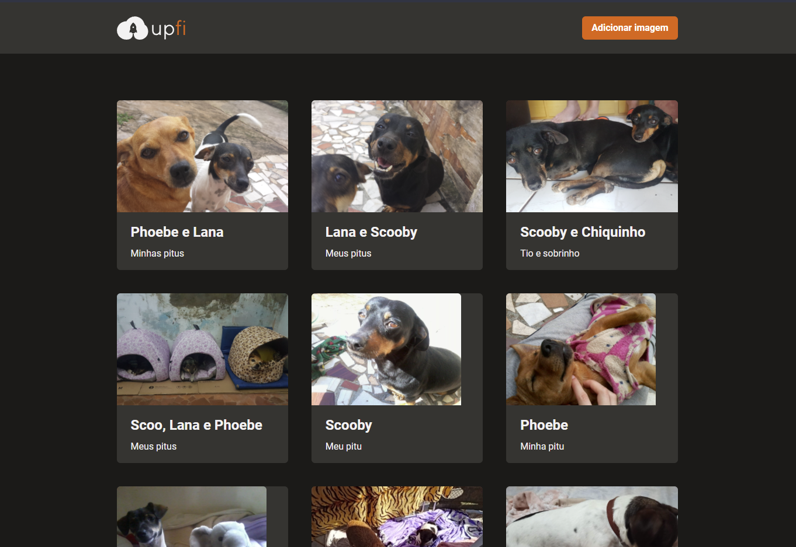

  

Esse é desafio feito durante minha jornada na Rocketseat.

# Desafio: Upload de imagens

Essa será uma aplicação onde o seu principal objetivo é adicionar alguns trechos de código para que a aplicação de upload de imagens funcione corretamente. Você vai receber uma aplicação com muitas funcionalidades e estilizações já implementadas. Ela deve realizar requisições para sua própria API Next.js que vai retornar os dados do FaunaDB (depreciado) e do ImgBB (serviço de hospedagem de imagens). A interface implementada deve seguir o layout do Figma. Você terá acesso a 4 arquivos para implementar:

- Infinite Queries e Mutations com React Query;
- Envio de formulário com React Hook Form;
- Exibição de Modal e Toast com Chakra UI;
- Entre outros.

## Se preparando para o desafio

Para esse desafio, iremos utilizar:

- React Query;
- React Hook Form;
- ImgBB;
- FaunaDB (depreciado);
- API do Next.js;
- Figma.

## Como executar

- Clone o repositório
- Instale as dependências com `yarn`
- Crie o arquivo `.env.local` e preencha com as API keys do IMGBB e FAUNA

* Para conferir os testes desse desafio, execute `yarn test`.

## Licença

Esse projeto está sob a licença MIT. Veja o arquivo [LICENSE](LICENSE.md) para mais detalhes.
